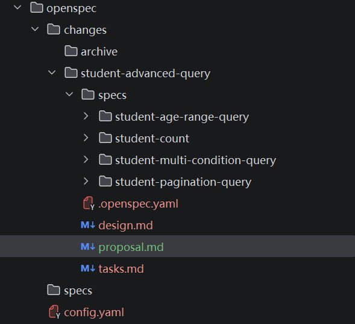
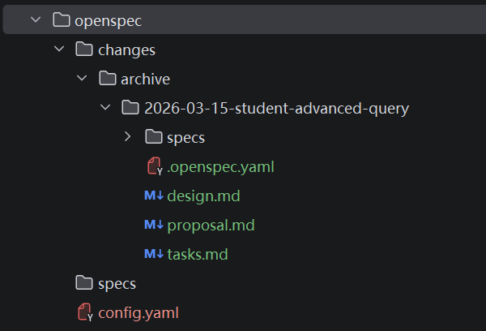

# OpenSpec的使用

## 一、是什么
OpenSpec 是一个面向 AI 辅助软件开发的轻量级规范驱动开发框架。它的核心目标是通过引入一个结构化的“规范”（Spec）工作流，来解决与 AI 结对编程时常见的“需求偏移”和“不可预测性”问题，帮助开发者和团队从依赖模糊提示的“Vibe Coding”转向更可靠、可审计的“规范驱动开发”。

地址 :https://github.com/Fission-AI/OpenSpec/tree/main
### 特点

-  轻量级：无需 API 密钥，设置简单，开箱即用。
-  棕地优先（Brownfield-first）：特别擅长处理现有项目的功能修改和演进（1→n），而不是只擅长从零创建新项目（0→1）。
-  清晰的变更追踪：通过独特目录结构，将所有变更（提案、任务、规范差异）集中管理，审核和回溯都非常方便。

| 方法 | 主要适用场景 | 变更管理方式 |关键特点 |
|:-------|:--------:|-------:|-------:|
| OpenSpec |   修改现有功能（1→n） |  分离specs/（真相）与changes/（提案），所有功能工件集中管理|擅长代码库演进，变更清晰可审计|
| spec-kit / Kiro|  全新项目开发（0→1）   |   结构较为松散，演进过程可能变得混乱|在定义全新功能方面表现突出|
| 无规范（Vibe Coding）| 非结构化、基于提示的任务  |   需求仅存在于聊天历史中，依赖 AI 猜测|不可预测，缺乏审计跟踪|


### 使用OpenSepc遵顼的流程

使用 OpenSpec 主要遵循一个清晰的四阶段工作流。整个过程可以通过 CLI 命令或在 AI 聊天界面中使用快捷命令完成。



```plantuml
flowchart TD
    A[“1. 起草变更提案<br>（用户发起意图）”] --> B[“2. 审查与对齐<br>（人机协作迭代）”]
    
    B -- 计划已批准 --> C[“3. AI驱动实施<br>（AI依据任务清单编码）”]
    C --> D[“4. 归档并更新真相源<br>（将变更合并回主规范）”]
    
    B -- 反馈与修改 --> B

```


## 二、如何使用

### 安装

#### 1.前提条件
确保系统已安装 Node.js 20.19.0 或更高版本

#### 2.全局安装 CLI 工具

```bash
npm install -g @fission-ai/openspec@latest
```

#### 3.在项目中初始化

```bash
cd your-project
openspec init
```
这个命令会创建一个 openspec/ 目录，并根据你使用的 AI 工具（如 Cursor, GitHub Copilot 等）配置相应的快捷命令


#### 目录结构

```text

openspec/
├── specs/                  # 规范的“单一真相源”，存放所有已确定的系统规范。
│   └── [功能模块]/         # 例如：auth, payment
│       └── spec.md
├── changes/                 # 存放所有进行中的变更。
│   └── [变更名称]/          # 例如：add-2fa, improve-search
│       ├── proposal.md      # 变更的“原因”和“内容”。
│       ├── tasks.md         # AI 实施的详细检查清单。
│       └── specs/           # 对主规范（specs/）的增量修改。
│           └── [功能模块]/
│               └── spec.md
└── project.md               # 可选，定义项目全局的约定、技术栈等
```


### 实践

```bash
YOU : /opsx:propose 开发一个学生模型的crud功能

AI: # Check existing demo files  
    # Check existing demo files  
    Thinking: All the CRUD functionality has already been created: 
     添加高级查询？
YOU ：是
AI:
                                                                                                          
  ┃  Thinking: The user wants to add advanced queries like:                                              
  ┃  - Query by age range                                                                                
  ┃  - Pagination query                                                                                  
  ┃                                                                                                      
  ┃  Let me create the change proposal for adding advanced query features.   
  
   # Create new change for advanced query                                                              
  ┃                                                                                                      
  ┃  $ openspec new change "student-advanced-query"                                                      
  ┃  - Creating change 'student-advanced-query'...                                                       
  ┃  ✔ Created change 'student-advanced-query' at openspec/changes/student-advanced-query/ (schema:      
  ┃  spec-driven)                                                                                        
  ┃                            

                                                                                                       
  ┃  Thinking: Now I have enough context to create the proposal. Let me write it.                        
                                                                                                         
  ┃                                                                                                      
  ┃  # Todos                                                                                             
  ┃                                                                                                      
  ┃  [•] Create proposal.md                                                                              
  ┃  [ ] Create design.md                                                                                
  ┃  [ ] Create specs                                                                                    
  ┃  [ ] Create tasks.md  
                 
  ┃  Thinking: Now let me get instructions for tasks.     Thinking: Now let me create the proposal.md file.  
  ...
 
  ┃  Thinking: Now let me get instructions for the design artifact. 
  ...
  
  ┃  Thinking: Now I need to create the design.md file based on the proposal and the existing codebase. 
  ...
  
  ┃  Thinking: Now let me check the status and create the specs. 
  ...
  
  ┃  Thinking: Now let me get instructions for tasks.   
    
                                                                                                                   
                                                                                                                     
  ┃  Thinking: All artifacts are created. Let me provide the summary.                                                
                                                                                                                  ▄  
     Change 创建完成                                                                                                 
                                                                                                                     
     Change 名称: student-advanced-query                                                                             
     位置: openspec/changes/student-advanced-query/                                                                  
                                                                                                                     
     创建的 Artifacts     
     
     ┌─────────────────────┬─────────────────────────────────────────────────────────────┬────────────────────────┐                                              
     │Artifact             │路径                                                          │描述                    │                                              
     ├─────────────────────┼─────────────────────────────────────────────────────────────┼────────────────────────┤                                              
     │proposal.md          │openspec/changes/student-advanced-query/proposal.md          │需求提案文档            │                                              
     ├─────────────────────┼─────────────────────────────────────────────────────────────┼────────────────────────┤                                              
     │design.md            │openspec/changes/student-advanced-query/design.md            │技术设计文档            │                                              
     ├─────────────────────┼─────────────────────────────────────────────────────────────┼────────────────────────┤                                              
     │specs                │specs/*/spec.md                                              │4个详细规格文档         │                                              
     ├─────────────────────┼─────────────────────────────────────────────────────────────┼────────────────────────┤                                              
     │tasks.md             │openspec/changes/student-advanced-query/tasks.md             │实现任务清单            │                                              
     └─────────────────────┴─────────────────────────────────────────────────────────────┴────────────────────────┘                                              
                                                                                                                                                                 
      规格文档                                                                                                                                                    
                                                                                                                                                                 
     - student-age-range-query/spec.md - 按年龄范围查询                                                                                                          
     - student-pagination-query/spec.md - 分页查询                                                                                                               
     - student-count/spec.md - 统计数量                                                                                                                          
     - student-multi-condition-query/spec.md - 多条件组合查询    
     
      任务清单预览                                                                                                                                                                                                                                                                                                    
     - Mapper 接口扩展 (4项)                                                                                                                                     
     - XML 映射配置 (4项)                                                                                                                                        
     - 测试用例 (4项)                                                                                                                                            
     - 验证 (2项)                                                                                                                                                
                                               
YOU: opsx:apply student-advanced-query
 
AI: Run /opsx:apply to start implementing.   

     Implementing: student-advanced-query (schema: spec-driven)                                                          • grep_app Connected                    
                                                                                                                         • websearch Connected                   
     Progress: 0/14 tasks complete                                                                                                                               
                                                                                                                         LSP                                     
     Working on task 1.1: 添加 selectByAgeRange 方法    
     
     .... 
     
                                                                                                                           116,951 tokens                          
  ┃  Thinking: All artifacts are complete. Now let me provide a summary.                                                 58% used                                
                                                                                                                         $0.00 spent                             
     Implementation Complete                                                                                                                                     
                                                                                                                         ▼ MCP                                   
     Change: student-advanced-query                                                                                      • context7 Connected                    
     Schema: spec-driven                                                                                                 • gitnexus MCP error -32000:            
     Progress: 14/14 tasks complete ✓                                                                                      Connection closed                     
                                                                                                                         • grep_app Connected                    
     Completed This Session                                                                                              • websearch Connected                   
     - [x] 1.1 selectByAgeRange 方法                                                                                                                             
     - [x] 1.2 selectPage 分页查询方法                                                                                   LSP                                     
     - [x] 1.3 countAll 统计方法                                                                                         LSPs will activate as files are read    
     - [x] 1.4 selectByConditions 多条件查询方法                                                                                                                 
     - [x] 2.1-2.4 XML 映射配置                                                                                          ▶ Modified Files                        
     - [x] 3.1-3.4 测试用例                                                                                                                                      
     - [x] 4.1-4.2 验证通过                                                                                                                                      
                                                                                                                                                                 
     新增功能                                                                                                                                                    
                                                                                                                                                                 
     ┌───────────────────────────────────────────────────────────────┬────────────────────────────────────────────┐                                              
     │方法                                                           │说明                                        │                                              
     ├───────────────────────────────────────────────────────────────┼────────────────────────────────────────────┤                                              
     │selectByAgeRange(minAge, maxAge)                               │按年龄范围查询                              │                                              
     ├───────────────────────────────────────────────────────────────┼────────────────────────────────────────────┤                                              
     │selectPage(offset, limit)                                      │分页查询                                    │                                              
     ├───────────────────────────────────────────────────────────────┼────────────────────────────────────────────┤                                              
     │countAll()                                                     │统计学生总数                                │                                              
     ├───────────────────────────────────────────────────────────────┼────────────────────────────────────────────┤                                              
     │selectByConditions(Map)                                        │多条件组合查询                              │                                              
     └───────────────────────────────────────────────────────────────┴────────────────────────────────────────────┘                                              
                                                  
      代码变更                                                                                                                                                    
                                                                                                                                                                 
     - StudentMapper.java - 新增4个方法                                                                                                                          
     - StudentMapper.xml - 新增4个SQL映射                                                                                                                        
     - StudentTest.java - 新增4个测试方法                                                                                                                        
                                                                                                                                                                 
     编译验证通过 ✓   
     
     
YOU: /opsx:archive

AI: 

                                                                                                                                                              
  ┃  # Verify archive                                                                                                                                            
  ┃                                                                                                                                                              
  ┃  $ ls openspec/changes/archive/                                                                                                                              
  ┃                                                                                                                                                              
  ┃  2026-03-15-student-advanced-query                                                                                                                           
  ┃                                                                                                                                                              
                                                                                                                                                                 
  ┃  Thinking: Archive successful!                                                                                                                               
                                                                                                                                                                 
     Archive Complete                                                                                                                                            
                                                                                                                                                                 
     Change: student-advanced-query                                                                                                                              
     Schema: spec-driven                                                                                                                                         
     Archived to: openspec/changes/archive/2026-03-15-student-advanced-query/                                                                                    
     Specs: No delta specs (main spec directory doesn't exist)                                                                                                   
                                                                                                                                                                 
     All artifacts complete. All tasks complete.         
```


#### openspec的目录变化

##### 1.完成前


#### 2.完成后


