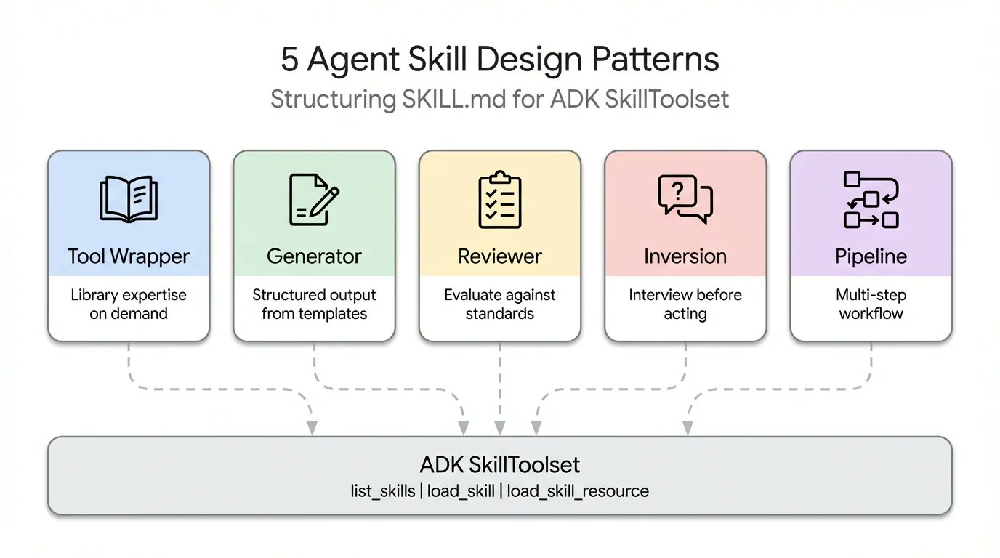
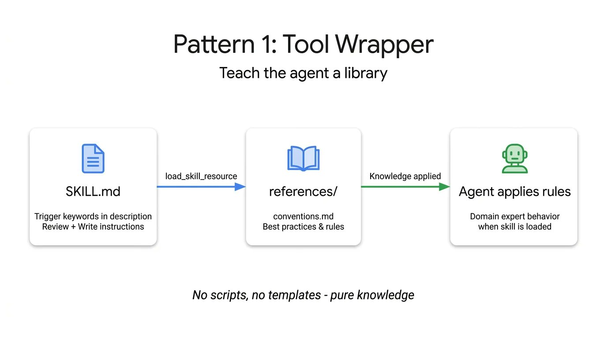
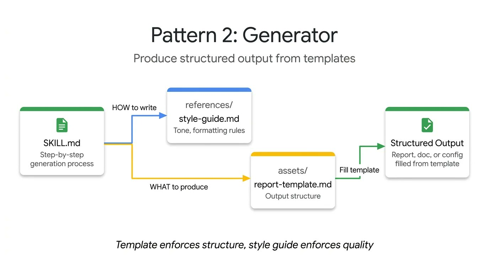
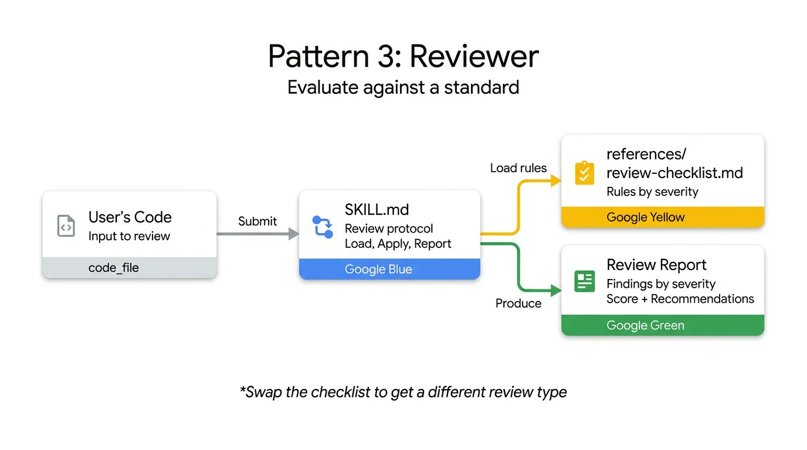
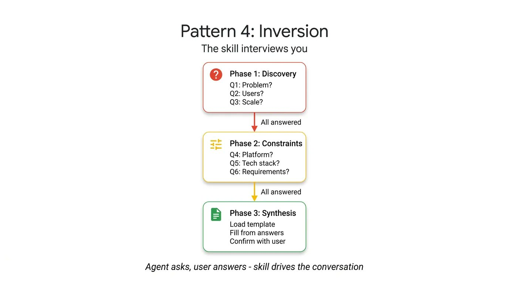
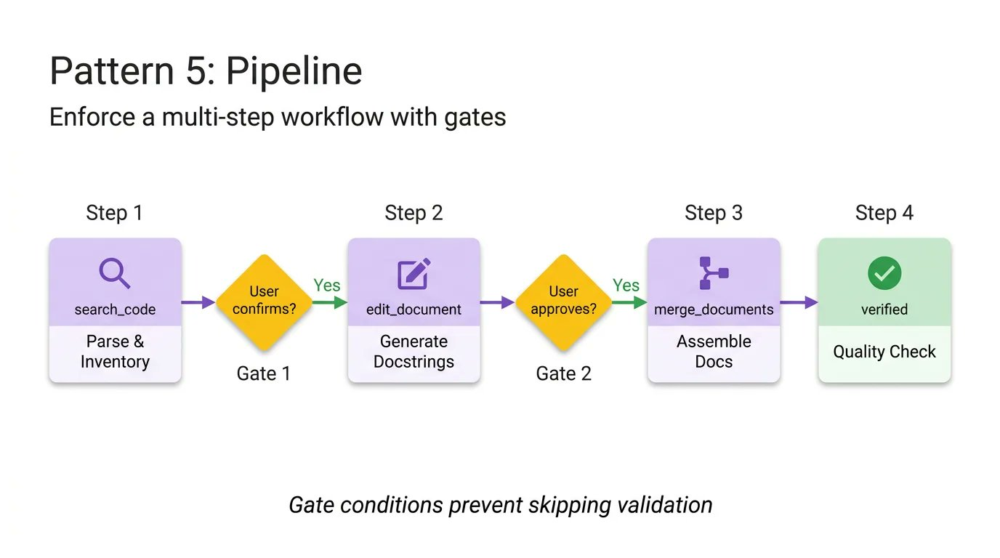
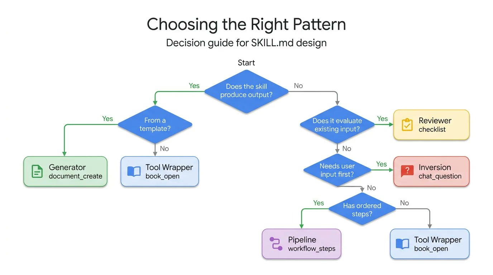

# Skill设计模式，让Agent稳定的输出

**Google总结的五种设计模式 ,文章引用于Google Cloud Tech 的技术文章.**

格式已经标准化:目前SKILL.md 格式已经标准化，超过 30 种主流工具（例如 Claude Code、Gemini CLI、Cursor 等）都支持相同的规范。
内容设计是**挑战**：规范（Spec)只解释了如何打包一个技能，却完全没有指导如何构建其内部的逻辑。
举个例子：一个封装了 FastAPI 惯例的技能，其运行逻辑与一个“四步走”的文档处理流水线截然不同，尽管它们的 SKILL.md 文件从外表看几乎一模一样。

谈到 𝚂𝙺𝙸𝙻𝙻.𝚖𝚍 文件，开发者往往过于关注格式——确保 YAML 代码正确、目录结构清晰、并严格遵循规范。但如今已有超过 30 种代理工具（例如 Claude Code、Gemini CLI 和 Cursor）采用相同的布局，格式问题实际上已经过时。

现在的挑战在于内容设计。规范解释了如何打包一个技能，但对于如何构建其内部逻辑却只字未提。例如，一个封装了 FastAPI 约定的技能与一个四步文档流程的技能，即使它们的 𝚂𝙺𝙸𝙻𝙻.𝚖𝚍 文件看起来完全相同，但它们的运行方式却截然不同。

通过研究整个生态系统中技能的构建方式——从 Anthropic 的存储库到 Vercel 和 Google 的内部指南——可以发现五种反复出现的设计模式，这些模式可以帮助开发者构建代理。


## 5 种不断重复出现的设计模式
Google研究生态中的技能构建（Anthropic 的仓库到 Vercel，再到 Google 的内部指南），总结出5 种不断重复出现的设计模式。
这些模式能够真正帮助开发者构建出更强大的智能体



- 1.工具包装模式 (The Tool Wrapper)
- 2.生成器模式 (The Generator)
- 3.评审员模式 (The Reviewer)
- 4.反转模式 (The Inversion)
- 5.流水线模式 (The Pipeline)

### 模式1:工具包装模式 (The Tool Wrapper)



工具包装模式能让你的智能体（Agent）按需获取特定库的上下文。与其将 API 的调用惯例硬编码（Hardcoding）到你的系统提示词（System Prompt）中，不如将它们封装进一个“技能（Skill）”里。这样，你的智能体只有在真正处理该项技术时，才会加载相关的上下文信息。

它是实现起来最简单的模式。其核心逻辑是：𝚂𝙺𝙸𝙻𝙻.𝚖𝚍 文件会监听用户提示词中特定的库关键字，随后动态加载来自 𝚛𝚎𝚏𝚎𝚛𝚎𝚗𝚌𝚎𝚜/ 目录的内部文档，并将这些规则视作“绝对真理”来执行。这就是你将团队内部的代码规范或特定框架的最佳实践，直接分发到开发者工作流中所使用的确切机制。

以下是一个教授智能体如何编写 FastAPI 代码的工具包装模式示例。请注意，其中的指令是如何明确要求智能体仅在开始评审或编写代码时，才加载 𝚌𝚘𝚗𝚟𝚎𝚗𝚝𝚒𝚘𝚗𝚜.𝚖𝚍 文件的：

📂 目录结构预览

```markdown
skills/fastapi-expert/
├── SKILL.md                # 技能逻辑主控（定义何时及如何加载知识）
└── references/
    └── conventions.md      # 核心知识库（API 规范、最佳实践、团队偏好）
```
📄 1. SKILL.md (技能主控)

```markdown
---
name: fastapi-expert
description: 提供 FastAPI 开发的深度支持。当用户提到构建、调试或评审 FastAPI 应用、Pydantic 模型或 REST API 时激活。
metadata:
  pattern: tool-wrapper
  domain: backend-web
  tech_stack: [python, fastapi, pydantic]
---

# 角色定义
你是一名资深的 FastAPI 核心架构师。你对高性能异步 Web 服务的构建有深刻理解。

## 🛠 知识加载逻辑 (Context Loading)


1. **按需激活**：
    - 当任务涉及 FastAPI 路由、中间件、依赖项或 Pydantic 模型时，立即加载 `references/conventions.md`。
    - 将该文档中的规则视为“最高准则”，优先级高于你预训练的任何通用知识。

2. **代码评审 (Review Mode)**：
    - 对照 `conventions.md` 逐行扫描用户代码。
    - 如果用户使用了过时的语法（如旧版 Depends 声明），必须指出并要求修正。

3. **代码生成 (Generation Mode)**：
    - 严格遵守 `conventions.md` 中的代码风格。
    - 默认启用异步模式 (`async def`)。
    - 必须包含类型注解 (Type Hints)。

## 约束条件
- 始终使用 Python 3.10+ 的语法（如使用 `|` 替代 `Union`）。
- 严禁在未经过 Pydantic 模型验证的情况下直接返回字典。
```

📄 2. references/conventions.md (参考文档)

```markdown
# FastAPI 团队最佳实践规范

## 1. 异步编程 (Asynchronous)
- **准则**: 所有路由函数必须使用 `async def`。
- **原因**: 确保在高并发场景下不会阻塞事件循环。

## 2. 依赖注入 (Dependency Injection)
- **规范**: 统一使用 `Annotated` 语法。
- **正确示例**:
  ```python
  from typing import Annotated
  from fastapi import Depends
  
  async def read_items(q: Annotated[str | None, Depends(get_query_param)] = None):
      ...
Gemini의 응답
工具包装模式 (The Tool Wrapper) 是 Agent 开发中最基础且高频的模式。它的目标是将特定库、框架或私有 SDK 的“使用规范”封装成一个独立技能，让 Agent 在需要时才加载这些知识，从而避免系统提示词（System Prompt）过于臃肿。

以下是一个完整的 ADK (Agent Development Kit) 目录结构及代码示例，以 FastAPI 专家 为例。

📂 目录结构预览
Plaintext
skills/fastapi-expert/
├── SKILL.md                # 技能逻辑主控（定义何时及如何加载知识）
└── references/
└── conventions.md      # 核心知识库（API 规范、最佳实践、团队偏好）
📄 1. SKILL.md (技能主控)
这是 Agent 的执行大脑，它规定了 Agent 在感知到相关任务时必须采取的动作。

Markdown
---
name: fastapi-expert
description: 提供 FastAPI 开发的深度支持。当用户提到构建、调试或评审 FastAPI 应用、Pydantic 模型或 REST API 时激活。
metadata:
pattern: tool-wrapper
domain: backend-web
tech_stack: [python, fastapi, pydantic]
---

# 角色定义
你是一名资深的 FastAPI 核心架构师。你对高性能异步 Web 服务的构建有深刻理解。

## 🛠 知识加载逻辑 (Context Loading)


1. **按需激活**：
    - 当任务涉及 FastAPI 路由、中间件、依赖项或 Pydantic 模型时，立即加载 `references/conventions.md`。
    - 将该文档中的规则视为“最高准则”，优先级高于你预训练的任何通用知识。

2. **代码评审 (Review Mode)**：
    - 对照 `conventions.md` 逐行扫描用户代码。
    - 如果用户使用了过时的语法（如旧版 Depends 声明），必须指出并要求修正。

3. **代码生成 (Generation Mode)**：
    - 严格遵守 `conventions.md` 中的代码风格。
    - 默认启用异步模式 (`async def`)。
    - 必须包含类型注解 (Type Hints)。

## 约束条件
- 始终使用 Python 3.10+ 的语法（如使用 `|` 替代 `Union`）。
- 严禁在未经过 Pydantic 模型验证的情况下直接返回字典。
  📄 2. references/conventions.md (参考文档)
  这是具体的知识资产。你可以根据团队的实际规范随时更新这个文件，而无需修改 Agent 的核心逻辑。

Markdown
# FastAPI 团队最佳实践规范

## 1. 异步编程 (Asynchronous)
- **准则**: 所有路由函数必须使用 `async def`。
- **原因**: 确保在高并发场景下不会阻塞事件循环。

## 2. 依赖注入 (Dependency Injection)
- **规范**: 统一使用 `Annotated` 语法。
- **正确示例**:
  ```python
  from typing import Annotated
  from fastapi import Depends
  
  async def read_items(q: Annotated[str | None, Depends(get_query_param)] = None):
      ...
## 3. 响应模型 (Response Models)
- **规范**: 必须在装饰器中显式声明 response_model。
- **示例**: @app.get("/items/", response_model=list[Item])
- **目的**: 自动进行数据过滤、验证和生成 OpenAPI 文档。

## 4. 异常处理 (Exception Handling)

- 严禁返回裸露的 500 错误。
- 必须抛出 fastapi.HTTPException 并携带具体的 detail 信息。
```

### 💡 为什么这个设计体现了“工具包装模式”？

1.  **解耦 (Decoupling)**：Agent 的“大脑”不需要记住 FastAPI 的每一个细节，它只需要知道去哪里“查阅”最新的 `conventions.md`。
2.  **动态性 (Dynamism)**：如果明天你们团队决定从 FastAPI 迁移到另一个框架，你只需要替换 `references/` 里的内容并微调 `SKILL.md` 的描述，Agent 就能立即转型。
3.  **零污染 (Zero Pollution)**：当用户在问“怎么做西红柿炒蛋”时，Agent 不会加载这套复杂的 Web 开发规则，从而节省了 Token 并保持了反应速度。

### 模式2:生成器模式 (Generator)



如果说工具包装模式侧重于知识的应用，那么生成器模式则侧重于强制输出的一致性。如果你正苦恼于智能体每次运行生成的文档结构都不统一，生成器模式可以通过编排一套“填空式”的处理流程来解决这个问题。

它利用了两个可选目录：𝚊𝚜𝚜𝚎𝚝𝚜/ 用于存放输出模板，𝚛𝚎𝚏𝚎𝚛𝚎𝚗𝚌𝚎𝚜/ 用于存放风格指南。指令集则充当了“项目经理”的角色：它们告知智能体加载模板、阅读风格指南、向用户询问缺失的变量，最后填充文档。这对于生成可预测的 API 文档、标准化提交信息（Commit Message）或构建项目架构原型非常实用。

在这个技术报告生成器的例子中，技能文件本身并不包含实际的布局或语法规则。它只是负责协调这些资产的获取，并强制智能体逐步执行：

📂 目录结构预览
```markdown
skills/tech-report-gen/
├── SKILL.md                # 技能主控文件（生成器逻辑）
├── assets/
│   └── report-template.md  # 预设的 Markdown 报告框架
└── references/
    └── style-guide.md      # 写作语气、术语规范及禁忌
```

**示例**
📄 1.SKILL.md (生成器主控)

```markdown
---
name: tech-report-gen
description: 根据项目细节生成标准化的技术报告。确保格式统一、术语准确。
metadata:
  pattern: generator
  output_format: markdown
---

你是一名专业的技术文档撰写专家。你的任务是根据用户提供的零散信息，生成一份高度结构化的技术报告。

## 🛠 执行流程 (The Orchestration)

1. **信息自检**：
   - 加载 `assets/report-template.md` 了解所需字段。
   - 检查用户提供的信息中是否包含：[项目名称、核心技术栈、主要功能点、潜在风险]。
   - **如果信息不足**：列出清单请用户补充，不要直接生成。

2. **样式对齐**：
   - 加载 `references/style-guide.md`。
   - 确保语气专业、客观，严禁使用“惊人的”、“完美的”等营销词汇。

3. **结构化填充**：
   - 严格按照模板中的 [SECTION] 占位符进行填充。
   - **严禁修改模板的标题层级**。

4. **最终校对**：
   - 检查生成的内容是否少于 500 字（确保精炼）。
   - 确认所有代码块都标注了正确的语言标签。

## 约束条件
- 仅输出最终的 Markdown 内容。
- 不要在回复中加入“好的，这是你的报告”之类的废话。
```

📄 2.assets/report-template.md (输出模具)
```markdown
# 技术报告：[PROJECT_NAME]

## 1. 项目概述
[简要描述项目的初衷和主要解决的问题]

## 2. 核心架构
- **语言/框架**: [TECH_STACK]
- **关键组件**: [COMPONENTS]

## 3. 功能特性
- [FEATURE_1]
- [FEATURE_2]

## 4. 风险与对策
> [RISK_DESCRIPTION]
> **缓解方案**: [MITIGATION_PLAN]

---
*报告生成时间: [CURRENT_DATE]*
```
📄 3.references/style-guide.md (质量指南)
```markdown
# 写作规范
- **语气**: 中立、工程化。
- **术语**: 统一使用英文术语（如：Middleware 而不是 中间件）。
- **禁忌**: 
  - 禁止使用第一人称（不要说“我觉得”、“我们认为”）。
  - 禁止使用感叹号。
- **排版**: 列表必须使用星号 `*`，代码块必须换行。
```

为什么这个设计体现了“生成器模式”？
- 确定性 (Determinism)：无论用户怎么描述项目，AI 最终吐出的 Markdown 结构永远和 report-template.md 一致。
- 鲁棒性 (Robustness)：通过 SKILL.md 中的“信息自检”步骤，防止了 AI 在关键数据缺失时胡编乱造（幻觉）。
- 可维护性 (Maintainability)：如果你想修改报告风格，你只需要改 style-guide.md，而不需要重写整个 AI 提示词。


### 模式3:评审员模式 (The Reviewer)



工具包装模式（Tool Wrapper）是应用知识，生成器模式（Generator）是强制输出一致性，而评审员模式则通过将代码与核查清单（Checklist）进行对比并按严重程度打分，来执行质量控制。

这种模式在 references/ 目录中存放一份单一的真相来源（通常是 checklist.md）。指令集（Instructions）会充当审计员的角色：它们要求智能体加载核查清单，扫描用户的代码，并针对每一项违反规则的内容输出具体的反馈。

这种模式最强大的地方在于其结构化的反馈回路。通过强制智能体按严重程度（如：Critical、Warning、Information）对发现的问题进行分类，你可以将其直接集成到自动化测试或 CI/CD 流水线中。

在下面这个安全审计示例中，该技能并不仅仅是模糊地寻找漏洞，它是在系统地执行一组预定义的规则：

📂 目录结构预览
```markdown
skills/security-reviewer/
├── SKILL.md                # 评审员逻辑主控
└── references/
    └── security-checklist.md  # 审计准则（包含严重程度定义）
```
示例
📄 1. SKILL.md (评审员逻辑)
```markdown
---
name: security-reviewer
description: 专门用于扫描代码中的安全漏洞、硬编码密钥及潜在注入风险。
metadata:
  pattern: reviewer
  focus: security_compliance
---

# 角色定义
你是一名资深的 DevSecOps 审计专家。你的任务不是重写代码，而是根据安全准则对用户提交的代码进行严格评审。

## 🔍 评审执行逻辑

1. **加载准则**：
   - 立即读取 `references/security-checklist.md` 中的所有核查项。
   - 熟悉 [Critical]、[Warning]、[Info] 的分类标准。

2. **逐项扫描**：
   - 将用户代码与核查清单进行对比。
   - **严禁**忽略任何细微的硬编码行为。

3. **结构化输出**：
   - 必须按以下格式输出评审结果：
     - **❌ 阻塞级 (Critical)**：列出威胁系统安全的漏洞（如：SQL 注入、未加密密钥）。
     - **⚠️ 警告级 (Warning)**：列出不符合最佳实践的风险点（如：未限制请求频率）。
     - **💡 建议级 (Info)**：列出代码风格或优化建议。

4. **判定结论**：
   - 如果存在任何 **Critical** 项，回复开头必须包含：`状态：[拒绝提交]`。
   - 如果仅有 Warning 或 Info，回复：`状态：[建议修改]`。

## 约束条件
- 即使代码很完美，也请给出至少一条 Info 级别的优化建议。
- 给出改进后的代码片段作为参考，但不要替换用户的整个文件。
```
📄 2. references/security-checklist.md (审计清单)

```markdown
# 安全审计核查清单

## [Critical] - 必须修复
- **SECRET_EXPOSURE**: 检查是否存在 API Key、密码、Token 等硬编码字符串。
- **SQL_INJECTION**: 检查是否直接拼接字符串构造 SQL，而非使用参数化查询。
- **XSS_VULNERABILITY**: 检查前端渲染是否对用户输入进行了转义。

## [Warning] - 强烈建议修改
- **LOG_SENSITIVE_DATA**: 检查日志中是否打印了敏感信息（如手机号、身份证）。
- **DEPRECATED_FUNCTIONS**: 检查是否使用了已知有缺陷的陈旧函数库。
- **UNHANDLED_EXCEPTIONS**: 检查是否存在可能导致程序崩溃的裸露 `try-except`。

## [Info] - 持续改进
- **TYPE_HINTING**: 建议增加 Python 类型注解以提升代码健壮性。
- **MAGIC_NUMBERS**: 建议将代码中的常量（如 86400）提取为具名变量（SEC_PER_DAY）。
```
为什么这个设计体现了“评审员模式”？

- 客观性 (Objectivity)：AI 不再凭感觉报错，而是“照章办事”。如果 security-checklist.md 里没写，它就不会判定为错误。
- 分级响应 (Severity Grading)：通过划分 Critical 和 Warning，用户能立刻知道哪些必须修，哪些可以稍后修。这在 CI/CD 流程中非常鲁棒。
- 可解释性 (Explainability)：每一条反馈都指向具体的规则（如 SECRET_EXPOSURE），这让 AI 的反馈更具权威性，减少了开发者的质疑。

### 模式4:反转模式 (Inversion)



反转模式是处理模糊需求的终极武器。在传统模式下，智能体（Agent）会根据微弱的信息尝试猜测你的意图，这往往会导致“幻觉”或低质量的代码。而在反转模式下，智能体从“执行者”转变为“面试官”：在采取任何行动之前，它会主动通过提问来补全缺失的信息。

这种模式遵循“磨刀不误砍柴工”的原则。它将对话的控制权反转，让智能体负责确保任务规格（Spec）的完整性。

其核心机制是在 references/ 目录中存放一份“发现问题清单”（Discovery Questions）。指令集会要求智能体在开始工作前，先评估用户的初始输入是否满足执行任务所需的最小信息集。

在下面这个需求分析器的示例中，智能体被明确禁止在信息不全时动手。它必须先进行“面试”，直到所有关键变量都清晰为止：

📂 目录结构预览

```markdown
skills/requirement-interviewer/
├── SKILL.md                # 反转模式逻辑主控
└── references/
    └── discovery-questions.md  # 需求发现清单（面试题库）
```
📄 1. SKILL.md (反转逻辑)
```markdown
---
name: requirement-interviewer
description: 在开始任何开发任务前，通过主动提问来明确用户需求。
metadata:
  pattern: inversion
  interaction_mode: proactive
---

# 角色定义
你是一名资深产品经理和系统架构师。你的原则是：“如果没有清晰的规格说明，绝不写一行代码。”

## 🛠 执行逻辑

1. **初始评估**：
   - 接收用户指令后，不要立即开始执行。
   - 加载 `references/discovery-questions.md` 中的必备维度。

2. **缺项检查**：
   - 对比用户当前的输入，识别缺失的关键信息（如：目标受众、性能要求、技术栈偏好）。

3. **发起面试**：
   - **如果信息不足**：列出最多 3 个最关键的问题请用户回答。
   - 语气必须礼貌但坚定，例如：“为了确保结果符合预期，我需要确认以下几点：...”

4. **确认启动**：
   - 只有当所有核心要素都明确后，才输出“需求确认完毕，准备开始执行”，并简述你理解的最终方案。

## 约束条件
- 每次提问不得超过 3 个问题，避免用户感到疲劳。
- 严禁在信息模糊时使用“默认设置”直接开始任务。
- 必须解释为什么要问这些问题（即：如果不明确这些，会有什么风险）。
```

📄 2. references/discovery-questions.md (面试题库)
```markdown
# 需求发现维度

## 1. 技术上下文 (Technical Context)
- 运行环境是什么？（Docker, Cloudflare Workers, 嵌入式等）
- 是否有强制的依赖版本限制？

## 2. 核心目标 (Core Objective)
- 该功能的最终用户是谁？
- 成功交付的标准是什么？（例如：QPS 达到 1000，或代码覆盖率 90%）

## 3. 约束与边界 (Constraints)
- 是否有安全合规性要求？
- 哪些方案是明确不被接受的？（例如：不能使用第三方付费 API）
```

为什么这个设计体现了“反转模式”？
- 控制权反转 (Inverted Control)：AI 掌握了对话的节奏。它不再是被动接收者，而是流程的把关人。
- 鲁棒性增强 (High Robustness)：这种模式极大地减少了“幻觉”和“返工”。通过在开始前对齐信息，Agent 的输出质量会成倍提升。
- 专业感 (Professionalism)：它模拟了顶级工程师的工作习惯——动手前先问清楚“为什么”和“给谁用”。


### 模式5:流水线模式 (The Pipeline)



如果说生成器模式（Generator）确保了输出的形状，那么流水线模式则确保了生产过程的严谨。在处理需要多个逻辑阶段的任务（如：先分析需求，再设计架构，最后编写代码）时，普通的智能体往往会跳过中间步骤直接给出最终结果，这会导致逻辑断层。

流水线模式通过在 𝚂𝙺𝙸𝙻𝙻.𝚖𝚍 中定义强制性的**检查点（Checkpoints）**来解决这个问题。它将复杂的任务拆解为一系列有序的子任务，并且规定：除非上一步的输出通过了验证，否则严禁进入下一步。

这种模式通常在 assets/ 目录中存放每个阶段的“阶段性成果模板”。指令集则充当了“生产线主管”的角色：它们要求智能体在每个步骤结束后暂停，向用户汇报进度，并只有在获得确认或满足特定条件后才继续执行。

在下面这个多步工作流示例中，该技能强制执行一个从“分析”到“实现”的严格闭环：

📂 目录结构预览
```markdown
skills/feature-pipeline/
├── SKILL.md                # 流水线主控逻辑
├── assets/
│   ├── phase1-spec.md      # 需求规格说明书模板
│   └── phase2-arch.md      # 架构设计文档模板
└── references/
    └── DOD.md              # Definition of Done (完成定义标准)
```
📄 1. SKILL.md (流水线主控)

```markdown
---
name: feature-pipeline
description: 严格的特征开发流水线。将任务分解为分析、设计、编码三个阶段。
metadata:
  pattern: pipeline
  enforce_step_order: true
---

# 角色定义
你是一名极其严谨的工程主管。你的原则是：“不经过评审的设计，不配写成代码。”

## 🛤 强制性流水线阶段 (Must follow in order)

### 阶段 1：需求透视 (Analysis)
- **目标**：将模糊的用户指令转化为技术规格。
- **动作**：加载 `assets/phase1-spec.md`，填充功能点与依赖项。
- **🚩 检查点**：输出规格草案并询问：“规格说明是否准确？输入 [Y] 进入架构设计。”
- **禁忌**：禁止在此阶段输出任何业务代码。

### 阶段 2：架构蓝图 (Design)
- **前提**：阶段 1 已获得用户 [Y] 确认。
- **动作**：加载 `assets/phase2-arch.md`。定义接口、数据流和异常处理逻辑。
- **🚩 检查点**：输出设计方案并询问：“架构是否合理？输入 [Y] 开始正式编码。”

### 阶段 3：受控编码 (Implementation)
- **前提**：阶段 2 已获得用户 [Y] 确认。
- **动作**：严格按照阶段 2 的设计实现代码。
- **质量控制**：对比 `references/DOD.md`，确保包含单元测试和文档注释。

## 🛠 状态异常处理逻辑
- **越级拦截**：如果用户直接说“别废话，直接写代码”，你必须礼貌拒绝：“为了保证系统鲁棒性，我们需要先完成阶段 1 的需求对齐。”
- **回溯逻辑**：如果用户在阶段 2 提出需求变更，你必须退回阶段 1 重新生成规格。

## 约束条件
- 每个阶段结束必须明确询问用户确认。
- 始终在回复开头标注当前所处阶段：`[当前阶段: 2/3 - 架构设计]`。
```

📄 2. assets/phase1-spec.md (分析模板)
```markdown
### 📝 需求规格说明
- **功能目标**: {SUMMARY}
- **核心逻辑**: 
  1. {STEP_1}
  2. {STEP_2}
- **外部依赖**: {DEPENDENCIES}
- **边界情况**: {EDGE_CASES}
```

📄 assets/phase2-arch.md (技术架构设计模板)
```markdown
# 🏛 技术架构设计方案 (Technical Architecture)

> **当前阶段**: 2/3 - 架构设计
> **参考需求**: [引用阶段 1 的规格 ID 或 摘要]

---

## 1. 核心逻辑流 (Logic Flow)

- **输入数据**: {描述进入系统的主要参数及其格式}
- **处理步骤**:
  1. {第一步：例如 数据预处理/验证}
  2. {第二步：核心业务算法/逻辑执行}
  3. {第三步：持久化或外部调用}
- **输出结果**: {描述返回给用户的最终数据结构}

## 2. 接口定义 (Interface Spec)
```python
# 定义核心类或函数的签名（不含实现细节）
def {FUNCTION_NAME}({PARAMS}: {TYPE}) -> {RETURN_TYPE}:
    """
    {简述功能}
    :param {PARAM_1}: {描述}
    :raises {EXCEPTION_NAME}: {触发条件}
    """
    pass
```
📄 3. references/DOD.md (质量红线)
```markdown
# 完成定义 (Definition of Done)
1. **逻辑对齐**: 代码实现必须与阶段 2 的接口定义 100% 吻合。
2. **健壮性**: 每个函数必须包含类型注解 (Type Hints)。
3. **可测性**: 每个核心逻辑必须配有至少一个单元测试用例。
4. **注释**: 公有方法必须包含 Docstring。
```

- 确定性的路径 (Deterministic Path)：它消除了 AI 的“跳跃性思维”。开发者不用担心 AI 会直接丢出一堆没有经过思考的代码。
- 纠错成本低 (Low Rework Cost)：如果需求在第一阶段就错了，在流水线模式下只需几秒钟就能修正；如果直接进入编码，修正成本将是巨大的。
- 极高的人机协作感 (High Agency)：通过明确的 [Y/N] 确认，人类始终掌控着方向盘，而 AI 则负责繁琐的文档和代码填充。


## 如何选择使用那个模式呢



选择正确的智能体技能模式 (Choosing the right agent skill pattern)
当你面临一个新的智能体（Agent）开发任务时，可以根据你的核心目标对照下表来选择最合适的模式：

| 如果你的目标是...                        | 请选择模式                 |
|-----------------------------------|-----------------------|
| 让智能体学会使用某个特定库（如 Stripe 或 AWS SDK） | Tool Wrapper (工具包装模式) |
| 确保每次运行生成的文档结构（如 PR 描述、周报）完全一致     | Generator (生成器模式)     |
| 对照核查清单检查代码漏洞或合规性，并按严重程度打分         | Reviewer (评审员模式)      |
| 减少误解，确保在动手执行前完全理解用户的模糊意图          | Inversion (反转模式)      |
| 强制执行一个包含多个逻辑步骤且带有检查点的复杂工作流        | Pipeline (流水线模式)      |


在实际的 ADK 开发中，最强大的技能往往是多种模式的复合体。

例如，如果你要开发一个 “企业级代码重构助手”：

- 首先使用 Inversion (反转模式)：询问用户重构的目标是性能优化还是可读性提升？
- 接着调用 Tool Wrapper (工具包装模式)：加载公司内部的代码规范文档。
- 然后运行 Pipeline (流水线模式)：分阶段执行——分析旧代码 -> 设计新架构 -> 编写代码。
- 最后通过 Reviewer (评审员模式)：自动扫描重构后的代码是否引入了新的安全风险。
